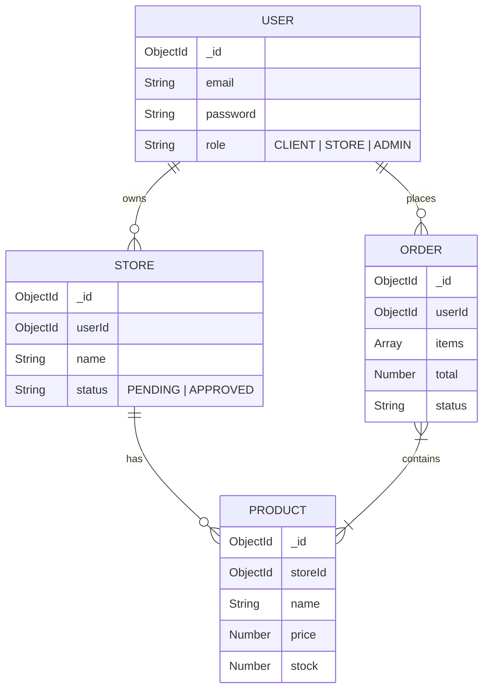

# Arquitectura del Sistema - MERCADOTECH MVP

## Diagrama de Arquitectura (C4 - Nivel Contenedor)

```mermaid
graph TD
    User((Usuario))
    Browser[Navegador Web\n(React App)]
    API[API Backend\n(Node.js + Express)]
    DB[(MongoDB Atlas)]

    User -- "Usa (HTTPS)" --> Browser
    Browser -- "API Calls (JSON/HTTPS)" --> API
    API -- "Lee/Escribe (Mongoose)" --> DB
```

## Patrones de Diseño

### Backend: 3-Layer Architecture
Para garantizar la separación de responsabilidades y facilitar el testing:

1.  **Controllers (Capa de Entrada):**
    *   Manejan las peticiones HTTP (Request/Response).
    *   Validan datos de entrada.
    *   Llaman a los Servicios.
    *   No contienen lógica de negocio.

2.  **Services (Capa de Negocio):**
    *   Contienen la lógica pura del negocio.
    *   Son agnósticos a la base de datos y al framework HTTP.
    *   Llaman a los Repositorios.

3.  **Repositories (Capa de Datos):**
    *   Abstraen el acceso a la base de datos (Mongoose).
    *   Realizan operaciones CRUD.

### Frontend: Component-Based & Context API
*   **Componentes:** Reutilizables y atómicos.
*   **Context API:** Para gestión de estado global (Auth, Carrito).
*   **Custom Hooks:** Para lógica reutilizable.

## Modelo de Datos (ERD Simplificado)


