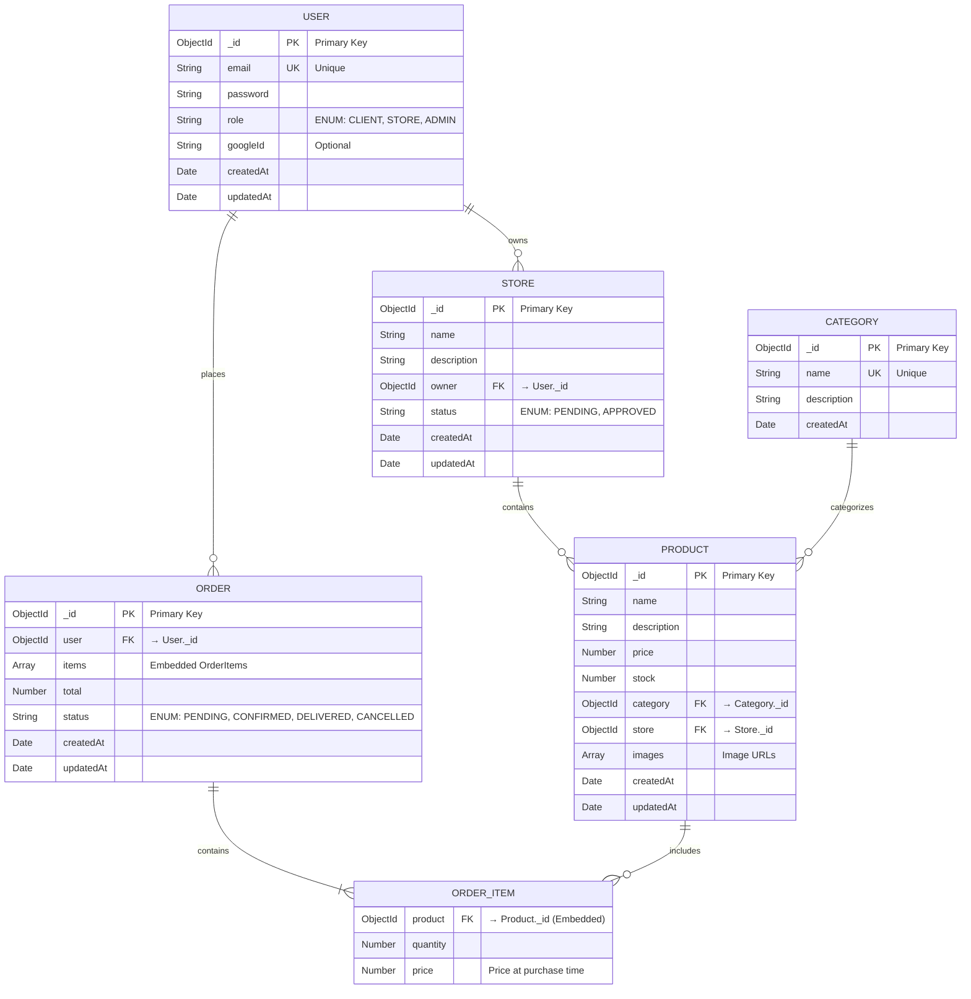

# MercadoTech - Entity Relationship Diagram

## Entidades

### User
**Primary Key:** `_id` (ObjectId)  
**Atributos:**
- `email` (String, Unique) - Correo electrónico del usuario
- `password` (String) - Contraseña hasheada
- `role` (Enum) - Rol: CLIENT, STORE, ADMIN
- `googleId` (String) - ID de Google si usa OAuth
- `createdAt`, `updatedAt` (Date)

### Store
**Primary Key:** `_id` (ObjectId)  
**Foreign Keys:** `owner` → User._id  
**Atributos:**
- `name` (String) - Nombre de la tienda
- `description` (String) - Descripción
- `status` (Enum) - Estado: PENDING, APPROVED
- `createdAt`, `updatedAt` (Date)

### Category
**Primary Key:** `_id` (ObjectId)  
**Atributos:**
- `name` (String, Unique) - Nombre de la categoría
- `description` (String)
- `createdAt` (Date)

### Product
**Primary Key:** `_id` (ObjectId)  
**Foreign Keys:** `category` → Category._id, `store` → Store._id  
**Atributos:**
- `name` (String) - Nombre del producto
- `description` (String)
- `price` (Number)
- `stock` (Number)
- `images` (Array<String>) - URLs de imágenes
- `createdAt`, `updatedAt` (Date)

### Order
**Primary Key:** `_id` (ObjectId)  
**Foreign Keys:** `user` → User._id  
**Atributos:**
- `items` (Array<OrderItem>) - Items del pedido (embedded)
- `total` (Number) - Total calculado
- `status` (Enum) - PENDING, CONFIRMED, DELIVERED, CANCELLED
- `createdAt`, `updatedAt` (Date)

### OrderItem (Embedded in Order)
**Foreign Keys:** `product` → Product._id  
**Atributos:**
- `quantity` (Number)
- `price` (Number) - Precio al momento de la compra

## Relaciones

| Relación | Cardinalidad | Descripción |
|----------|--------------|-------------|
| User → Store | 1:N | Un usuario puede tener varias tiendas |
| User → Order | 1:N | Un usuario puede tener varios pedidos |
| Store → Product | 1:N | Una tienda puede tener varios productos |
| Category → Product | 1:N | Una categoría puede tener varios productos |
| Order → OrderItem | 1:N | Un pedido puede tener varios items (embedded) |
| Product → OrderItem | 1:N | Un producto puede estar en varios pedidos |
