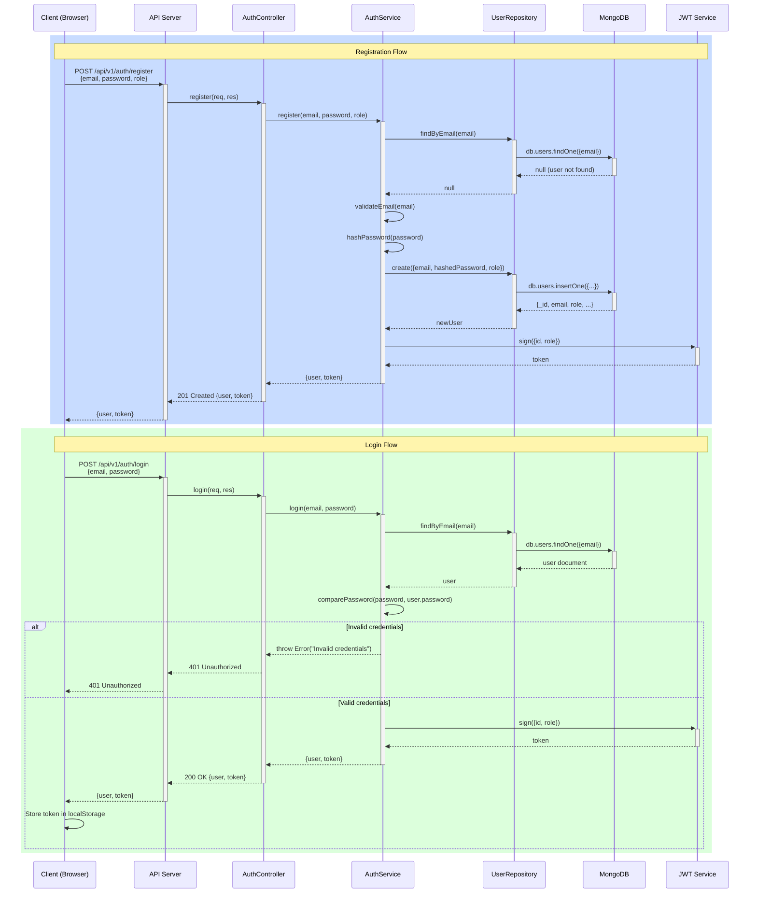

# Diagrama de Secuencia: Autenticación (Register & Login)

## Descripción
Este diagrama muestra el flujo completo de autenticación en MercadoTech, incluyendo:
1. **Registro de usuario:** Creación de cuenta nueva con validación y hash de contraseña
2. **Login de usuario:** Autenticación con credenciales y generación de JWT

## Participantes

| Participante | Descripción |
|--------------|-------------|
| **Client** | Navegador del usuario (Frontend React) |
| **API** | Servidor Express (backend) |
| **AuthController** | Controlador de endpoints de autenticación |
| **AuthService** | Lógica de negocio de autenticación |
| **UserRepository** | Capa de acceso a datos de usuarios |
| **MongoDB** | Base de datos |
| **JWT Service** | Librería jsonwebtoken para generar tokens |

## Flujo de Registro

1. Usuario envía datos de registro (email, password, role)
2. API valida request y delega a AuthController
3. AuthController llama a AuthService
4. AuthService verifica que email no exista en DB
5. Si email es nuevo:
   - Valida formato de email
   - Hashea la contraseña con bcrypt
   - Crea usuario en DB vía UserRepository
   - Genera token JWT
   - Retorna usuario y token
6. Cliente recibe status 201 Created y guarda token

## Flujo de Login

1. Usuario envía credenciales (email, password)
2. API delega a AuthController
3. AuthController llama a AuthService
4. AuthService busca usuario por email en DB
5. Si usuario existe:
   - Compara contraseña enviada vs hash almacenado
   - Si coincide: genera JWT y retorna usuario + token
   - Si NO coincide: lanza error 401  Unauthorized
6. Cliente guarda token en localStorage para peticiones futuras

## Seguridad

- Contraseñas hasheadas con bcrypt (salt rounds = 10)
- JWT firmado con secret key del servidor
- Token expira en 30 días (configurable)
- Validación de email único antes de registro
