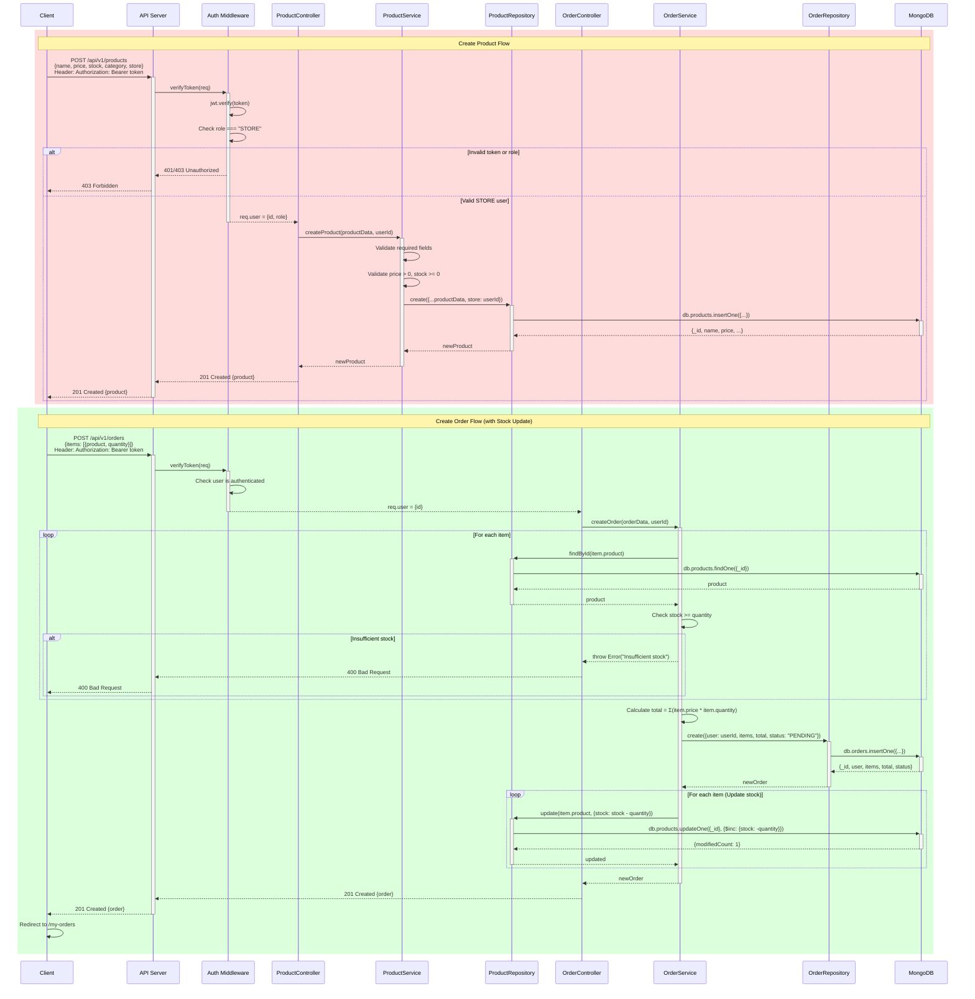

# Diagrama de Secuencia: CREATE Operaciones

## Descripción
Este diagrama muestra los flujos de creación de:
1. **Producto:** Creación por vendedor autenticado
2. **Pedido:** Creación por cliente con validación de stock y descuento automático

## Create Product

### Flujo
1. Client envía POST con datos del producto y token JWT
2. Auth Middleware verifica:
   - Token válido
   - Usuario tiene rol STORE
3. ProductController delega a ProductService
4. ProductService valida datos (precio > 0, stock >= 0)
5. ProductRepository persiste en MongoDB
6. Se retorna producto creado con status 201

### Validaciones
- Token JWT válido
- Rol de usuario = STORE
- Campos requeridos: name, price, stock, category
- Precio > 0
- Stock >= 0

## Create Order

### Flujo
1. Client envía POST con items del pedido
2. Auth Middleware verifica usuario autenticado
3. OrderService valida cada item:
   - Busca producto en DB
   - Verifica stock suficiente
4. Si hay stock:
   - Calcula total del pedido
   - Crea orden en estado PENDING
   - **Descuenta stock** de cada producto
5. Retorna orden creada

### Validaciones
- Usuario autenticado
- Productos existen en DB
- Stock suficiente para cada item
- Cantidades > 0

### Transacciones
- La creación de orden y actualización de stock deben ser atómicas
- Si falla actualización de stock, se revierte creación de orden
