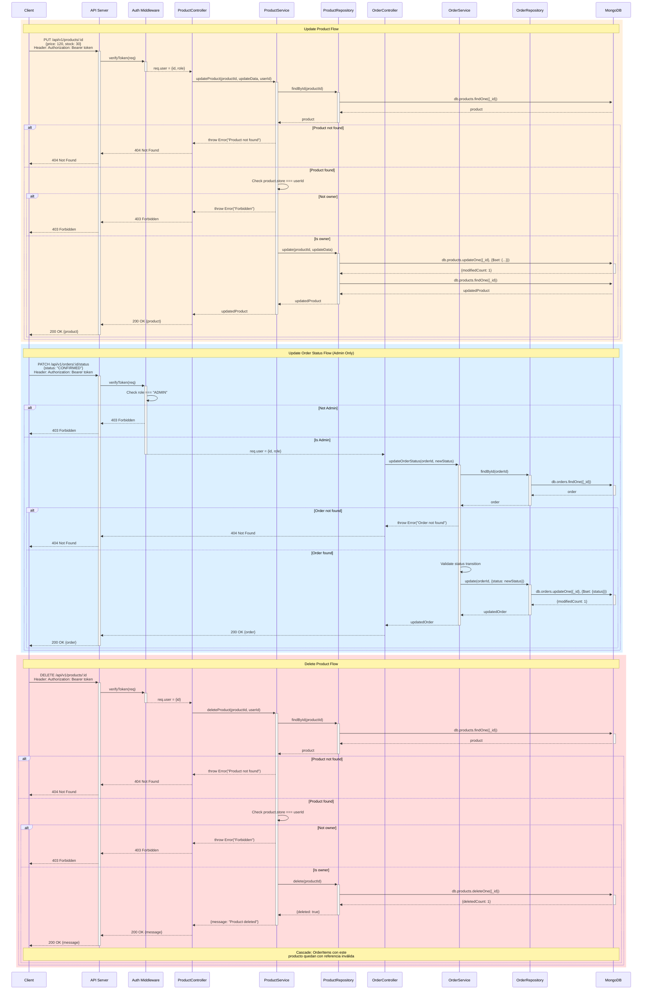

# Diagrama de Secuencia: UPDATE y DELETE Operaciones

## Descripción
Este diagrama muestra los flujos de:
1. **Update Product:** Actualización por propietario de la tienda
2. **Update Order Status:** Actualización por administrador
3. **Delete Product:** Eliminación con verificación de permisos

## Update Product

### Flujo
1. Client envía PUT con datos a actualizar
2. Auth Middleware verifica usuario autenticado
3. ProductService busca producto en DB
4. Verifica que user.id === product.store (es el dueño)
5. Si es dueño: actualiza y retorna producto actualizado
6. Si no es dueño: 403 Forbidden

### Validaciones
- Producto existe
- Usuario es propietario de la tienda
- Datos de actualización válidos

## Update Order Status

### Flujo
1. Client (Admin) envía PATCH con nuevo status
2. Auth Middleware verifica rol ADMIN
3. OrderService busca orden en DB
4. Valida transición de estado válida:
   - PENDING → CONFIRMED → DELIVERED
   - Cualquier estado → CANCELLED
5. Actualiza status en DB

### Validaciones
- Usuario es ADMIN
- Orden existe
- Transición de estado válida

### Estados Permitidos
- PENDING
- CONFIRMED
- DELIVERED
- CANCELLED

## Delete Product

### Flujo
1. Client envía DELETE
2. Auth Middleware verifica usuario autenticado
3. ProductService verifica:
   - Producto existe
   - Usuario es dueño
4. Si cumple condiciones: elimina producto

### Consideraciones
- **Cascada:** OrderItems que referencian este producto mantienen referencia
- En producción se debería:
  - Soft delete (marcar como inactivo)
  - O impedir eliminación si hay pedidos asociados
  - O usar referencias pobladas con productos archivados

### Validaciones
- Producto existe
- Usuario es propietario
- (Opcional) No hay pedidos activos con este producto
